# Reader Mode

A Chrome extension (Manifest V3) for comfortable reading: a clean reader overlay, removal of intrusive interface elements (cookie banners, popups), and persistence of your reading position across visits.

> Module 1 of a two-module suite. Module 2 (AI summarizer) will start after this module is stable. The full decision log and epic breakdown live in [docs/plan-projet-reader-mode.md](docs/plan-projet-reader-mode.md) (French).

## What it does

- **Reader overlay** — a distraction-free reading view rendered in a closed Shadow DOM on top of the real page. The URL, history and share behavior stay untouched; switching between reader and native view is instant.
- **Interface cleanup** — known popups and cookie banners are hidden before first paint via manifest-declared CSS. Every hidden element is visible in a badge and restorable in one click. An opt-in aggressive mode catches unknown dynamic popups.
- **Reading position persistence** — pages you actually read (15+ seconds, real scrolling) remember where you left off, locally, with a 7-day TTL. Pinned pages ("read later") keep their position for 90 days. Nothing leaves the machine.

## System design

The extension runs across four MV3 execution contexts. `chrome.storage.local` is the single source of truth; every context hydrates from it through `onChanged`:



The core feature — position persistence — is a capture/restore cycle built on text anchors rather than scroll offsets, so positions survive inserted ads, edits and layout shifts:



Key properties of the anchoring model:

- **Capture**: 3 text anchors (above / center / below the 40% viewport line), each with exact text, prefix/suffix context, ordinal block index and a content fingerprint. Serialized record stays under 2 KB.
- **Restore cascade**: `exact` → `fuzzy` (trigram shingles + Jaccard, threshold 0.8) → `ordinal` (if structural drift < 0.15) → `percent` → `abort`. A wrong match is worse than no match: the cascade never scrolls to a false positive.
- **Symmetry**: capture and restoration share one text normalization function (`normalizeText` in `@reader-mode/core`) — NFKC, smart quotes, exotic spaces, dash unification. Asymmetry here is the difference between ~85% and ~98% match rates.

## Repository structure

```
packages/
  core/        Pure TypeScript: anchoring, extraction, rules engine.
               No Chrome APIs — fully testable in Node (vitest + happy-dom).
  extension/   Chrome wiring: Vite + CRXJS + React + Tailwind.
               MV3 manifest, service worker, content script, popup.
scripts/
  fetch-fixtures.mjs   Snapshots ~20 real pages into fixtures/.
fixtures/      Versioned HTML snapshots used by the anchoring test harness.
docs/          Project plan, decision log (ADR), design diagrams.
```

The split is deliberate (decision D23): ~80% of the critical logic lives in `core` and runs in CI against real-page fixtures, without a browser.

## Getting started

Prerequisites: Node ≥ 22, pnpm ≥ 10.

```sh
pnpm install
pnpm build          # builds packages/extension/dist
```

Load it in Chrome:

1. Open `chrome://extensions`
2. Enable **Developer mode**
3. **Load unpacked** → select `packages/extension/dist`

Development:

```sh
pnpm --filter @reader-mode/extension dev   # Vite dev server with HMR
pnpm test                                  # core unit tests
pnpm typecheck                             # all packages
pnpm lint && pnpm format:check
pnpm fixtures                              # refresh fixture snapshots
```

## Roadmap

| Epic                       | Scope                                                | Status  |
| -------------------------- | ---------------------------------------------------- | ------- |
| 0 — Foundations            | Monorepo, extension skeleton, CI, fixtures           | ✅ Done |
| 1 — Anchoring engine       | Text anchors, restore cascade, mutation test harness | 🔜 Next |
| 2 — Position persistence   | Capture/restore wired into the extension, popup v1   | Planned |
| 3 — Rules engine & cleanup | Remote JSON rules, pre-paint CSS, restore badge      | Planned |
| 4 — Reader overlay         | Shadow DOM reader view with anchor continuity        | Planned |
| 5 — Aggressive mode        | MutationObserver heuristics, feedback loop           | Planned |
| 6 — Publication            | Chrome Web Store, options page, release pipeline     | Planned |

**Milestone M1 gate** (end of Epic 1): if exact+fuzzy restoration is below 95% on the fixture corpus, the anchoring design is revisited before any further investment.

## Engineering practices

### Definition of Done

A change is done when all of the following hold — partial work stays on a branch:

1. `pnpm lint`, `pnpm format:check` and `pnpm typecheck` pass.
2. `pnpm test` passes; new logic in `core` ships with unit tests.
3. `pnpm build` produces an extension that loads in Chrome without manifest errors.
4. CI is green.
5. Behavior that depends on a documented decision (D1–D26) matches that decision, or the decision log is updated in the same change.
6. Each epic additionally has its own exit criteria ("Done quand") in the [project plan](docs/plan-projet-reader-mode.md) — an epic is closed only when they are met.

### Commit conventions

- [Conventional Commits](https://www.conventionalcommits.org/): `feat(core): …`, `fix(extension): …`, `chore: …`, `ci: …`, `docs: …`.
- One logical change per commit; the repo builds and tests green at every commit.
- Subject in imperative mood, ≤ 72 chars; body explains _why_ when it is not obvious.
- No `Co-Authored-By` or other trailers.
